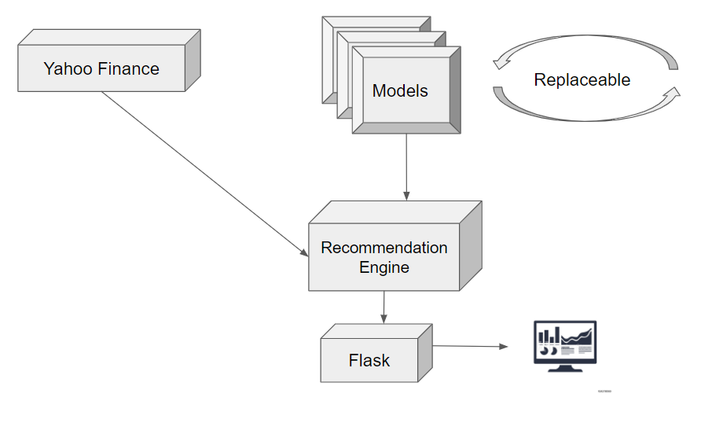

# Stock Price Predictor
This is the source code for an online app that shows live predictions of stock price movements.

## Setup
This is a PyCharm project with a virtual python environment (the 'venv' folder is git ignored). To run this app locally, follow these instructions:
<ol>
    <li>Clone the source code in this repo</li>
    <li>Get PyCharm from <a href="https://www.jetbrains.com/pycharm/download">here</a> </li>
    <li>Launch PyCharm</li>
    <li>Create new project</li>
    <li>Select the folder that you cloned the source code to</li>
    <li>This project was built with Python 3.7.2 x64 (Virtual Env) so select python environment accordingly</li>
    <li>If you intend on using virtual environment, when PyCharm asks whether or not to create from existing sources? Say NO</li>
    <li>This will create a virtual environment for you</li>
    <li>In command prompt, navigate to the root directory and run the following commands:</li>
    <li>pip install pandas</li>
    <li>pip install yfinance</li>
    <li>pip install lxml</li>
    <li>pip install matplotlib</li>
    <li>pip install pyyaml</li>
    <li>Right click on the file ./website/app.py and click run</li>
    <li>If there are no error messages, the website is running <a href="http://localhost:3001">here</a></li>
</ol>

## Architecture
The following is the outline for the architecture for the project:
