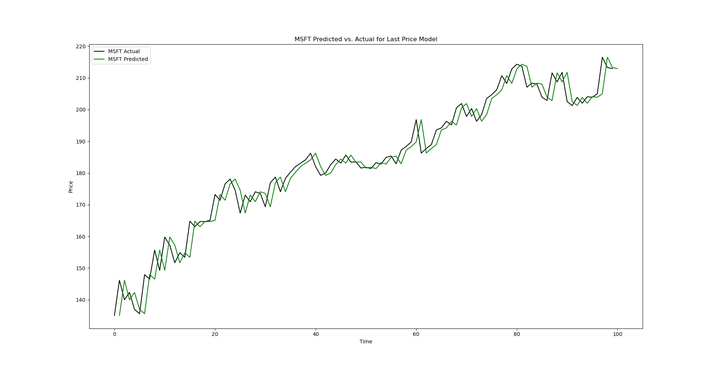
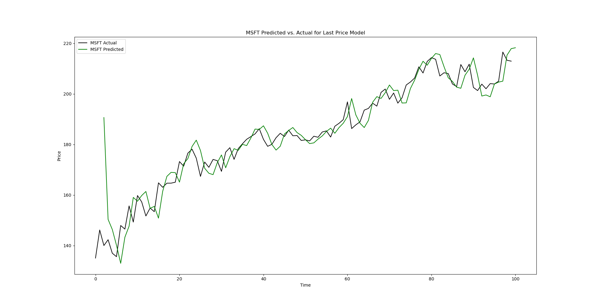
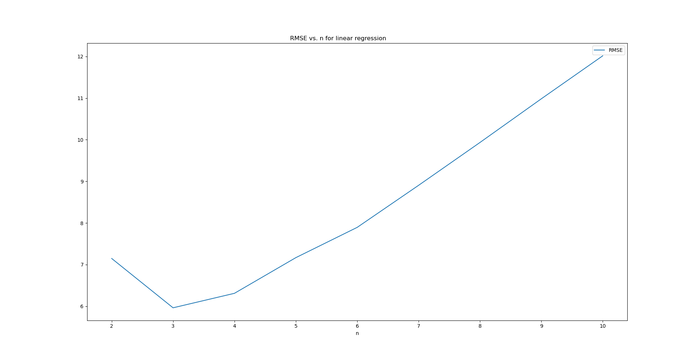
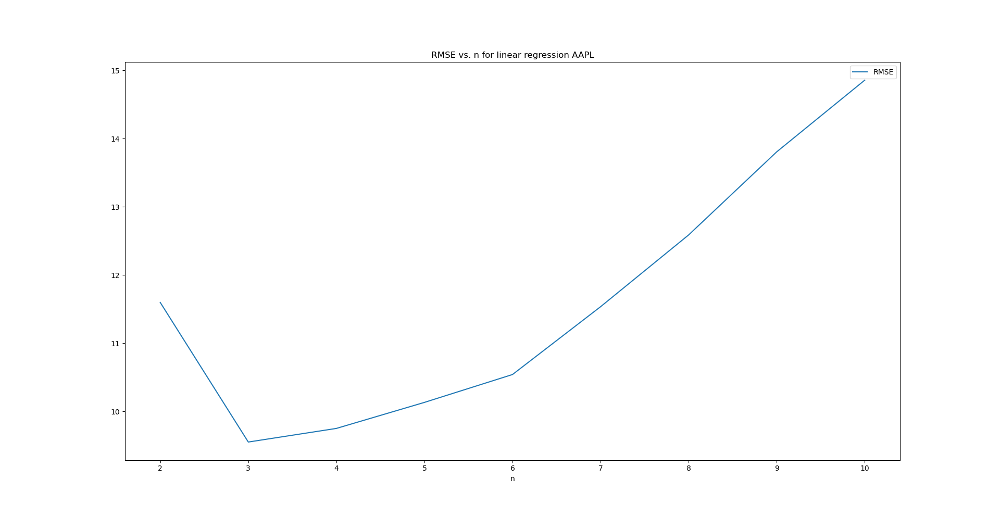
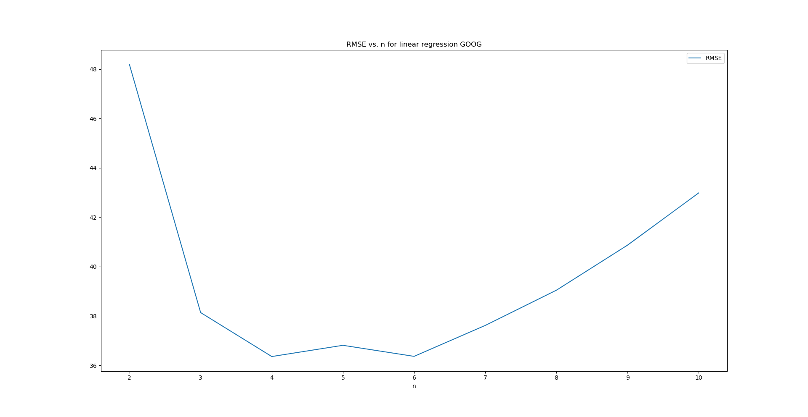
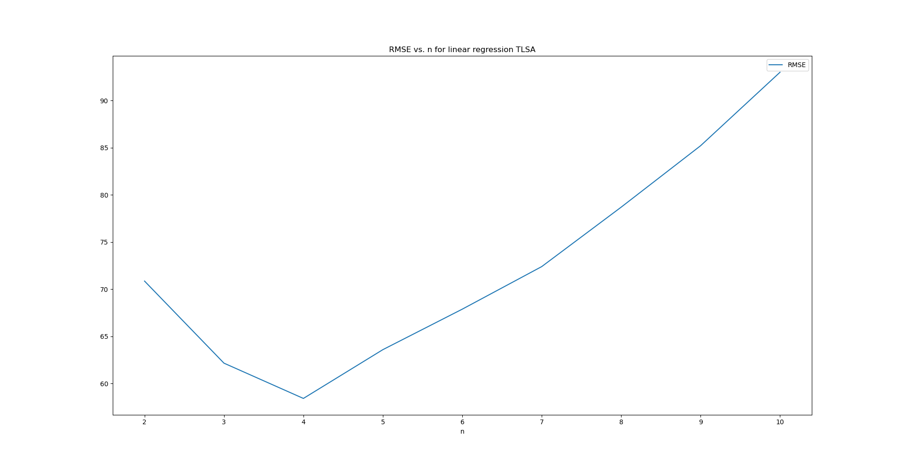
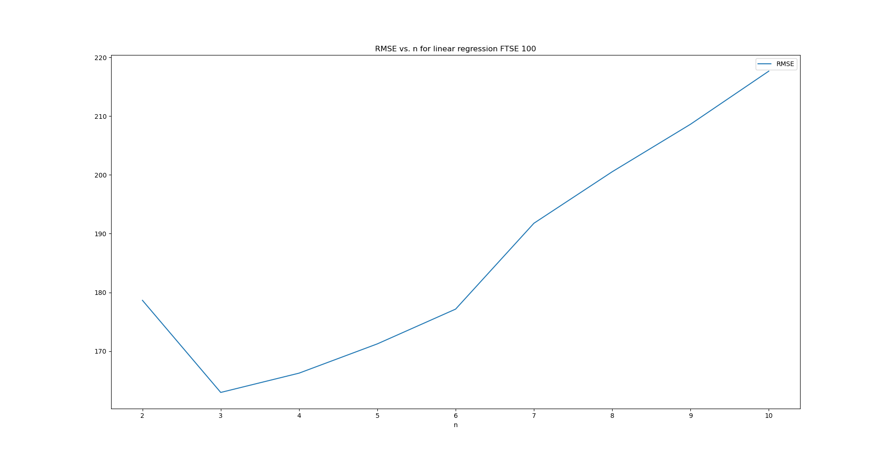
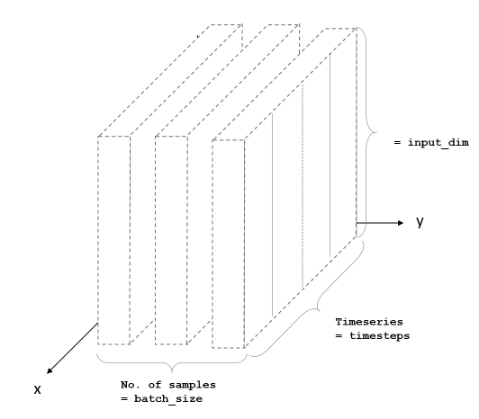

# Investigations
Here, I've documented the steps that I took to investigate the stock data in order to make price predictions.

## Analysis

### Data Exploration
All the raw data used for the analysis here was sourced from Yahoo Finance. It was very straight-forward to obtain as Yahoo has released a PyPi package called  <a href="https://pypi.org/project/yfinance/">yfinance<a>. Using this package, one can simply specify a period and obtain all historic data as a dataframe like this:

```python
import yfinance as yf

msft = yf.Ticker('MSFT').history(period='10Y')

print(msft.head())

```
This will produce the following:
```
             Open   High    Low  Close    Volume  Dividends  Stock Splits
Date                                                                     
2010-08-06  19.89  20.19  19.77  20.18  55982100        0.0             0
2010-08-09  20.18  20.33  20.04  20.23  57096500        0.0             0
2010-08-10  20.01  20.02  19.65  19.80  87257700        0.0             0
2010-08-11  19.50  19.67  19.40  19.64  76746900        0.0             0
2010-08-12  19.29  19.50  19.24  19.35  70240500        0.0             0
```
The limit for free usage is 2,000 requests/hour per IP which is more than sufficient for research. This was the starting point for all my analysis and the following section details the specifics of my investigations along with all the visuals.

## Model 1: Last Price
What we are trying to do here is predict stock prices. The problem is one of time series analysis. To be more specific, stock price movements can be understood or modelled as brownian motion. For this reason, when assessing the accuracy of any model, it should be benchmarked against the last price model as this is the most naive prediction of where the stock price will be at time t + 1. The model predicts the price at t + 1 to be the same as the price as t. The following is a chart to visualize what this looks like for MSFT for a 100 day prediction:



As you can see the predicted prices are just the same chart right shifted by a day.

## Model 2: Linear Regression
As the name suggests, this model uses linear regression on the last n days to predict what the price will be on the next day. This model is also based on the idea that price movements have a certain trend over a given amount of time and this can be captured by linear regression. I ran MSFT data through this model with n = 5 for the last 100 days. The following is what I got:



As you can see from the chart above, the linear regression model essentially uses the price momentum to make predictions. The hyper-parameter here is n which means we perform linear regression on the n most recent days. The next logical thing to do is to find the optimal value for n (ie. one that minimizes the RMSE). For this reason, I looked at the relation between n and RMSE. Based on the same data, I plotted RMSE vs. n and this is what I got:



What we can see above is that n = 3 is the ideal value for linear regression. To satisfy, my curiosity, I decided to see:
1. What happens at higher values of n
2. How does this model perform for different stock

To address, the first question, I took the value of max n to 100 and the following is what I got:


As we can see from the above, extending n does not bring down RMSE.

The following are the same charts for Google, Tesla, Apple, FTSE:

| | | 
|:-------------------------:|:-------------------------:|
|
|

As you can see from the charts above, the ideal value for n always hovers around the 3-5 mark. I believe this uniformity may be a result of the fact that the volatility of stocks on a daily basis is not that different.

# Model 3: LSTM
## Recurrent Neural Networks
Once I had done some basic research on the stock price data and used some simple models, I decided to create a more sophisticated model based on machine learning. When it comes to time-series analysis, recurrent neural networks are a popular choice to make inferences about the future. RNNs are essentially derived from simple feed-forward neural networks except that they are chained together in a sequence which captures the temporal element of the training data. The following is a diagram to illustrate the basic structure:


<a href="https://en.wikipedia.org/wiki/Recurrent_neural_network#/media/File:Recurrent_neural_network_unfold.svg">Source<a>

The key points are that it has 1 node for 1 point in time, every node has an input which receives data from the previous node and and output node which passes this data to the next node. In the context of supervised learning, each time steps results in the modification of the hidden state of the current node. This modification is the vehicle for the learning.

## Long short-term memory
The biggest short-coming of RNNs is the vanishing gradient problem. Technically this means that as training proceeds, the nodes at the beginning have a smaller and smaller impact on the modification of the hidden state as training proceeds to the later nodes. Conceptually, this means that the earlier training data can have a negligible impact on the final model. This is a problem because the significance of the patterns in the data do not necessarily become less relevant as time passes.

Enter the LSTM, which stands for Long short-term memory. The following is a diagram of its structure:


<a href="https://colah.github.io/posts/2015-08-Understanding-LSTMs/img/LSTM3-chain.png">Source<a>

The LSTM is a modified version of the simple RNN. The basic structure and the temporal element is essentially the same. The key difference is that LSTMs have a cell state (represented by the line at the top of a cell). An LSTM is able to control what is retrieved and what is forgotten in this cell state, thus enabling it to store long term patterns in data.

## Modelling
To start off, I decided to create a bare bones LSTM based on MSFT's stock price data. I used the Keras PyPi package for this which makes it quite straight-forward. 

### Pre-processing
The Keras implementation of LSTM requires training data to have 3 dimensions for sample size, time steps, and input dimensions respectively. The following diagram illustrates this:



<a href="https://cdn-images-1.medium.com/freeze/max/1000/1*v5_QpzkQfufVogeCY9eaOw.png?q=20">Source<a>

My training set was around 2000 days and my validation set was slightly over 500 days.