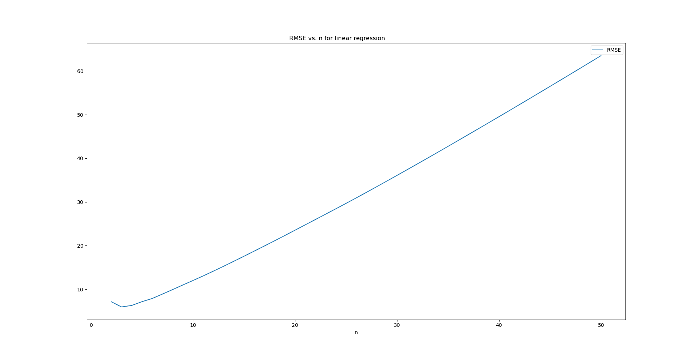

# Investigations
Here, I've documented the steps that I took to investigate the stock data in order to make price predictions.

## Analysis

### Data Exploration
All the raw data used for the analysis here was sourced from Yahoo Finance. It was very straight-forward to obtain as Yahoo has released a PyPi package called  <a href="https://pypi.org/project/yfinance/">yfinance<a>. Using this package, one can simply specify a period and obtain all historic data as a dataframe like this:

```python
import yfinance as yf

msft = yf.Ticker('MSFT').history(period='10Y')

print(msft.head())

```
This will produce the following:
```
             Open   High    Low  Close    Volume  Dividends  Stock Splits
Date                                                                     
2010-08-06  19.89  20.19  19.77  20.18  55982100        0.0             0
2010-08-09  20.18  20.33  20.04  20.23  57096500        0.0             0
2010-08-10  20.01  20.02  19.65  19.80  87257700        0.0             0
2010-08-11  19.50  19.67  19.40  19.64  76746900        0.0             0
2010-08-12  19.29  19.50  19.24  19.35  70240500        0.0             0
```
The limit for free usage is 2,000 requests/hour per IP which is more than sufficient for research. This was the starting point for all my analysis and the following section details the specifics of my investigations along with all the visuals.

## Model 1: Last Price
What we are trying to do here is predict stock prices. The problem is one of time series analysis. To be more specific, stock price movements can be understood or modelled as brownian motion. For this reason, when assessing the accuracy of any model, it should be benchmarked against the last price model as this is the most naive prediction of where the stock price will be at time t + 1. The model predicts the price at t + 1 to be the same as the price as t. The following is a chart to visualize what this looks like for MSFT for a 100 day prediction:


As you can see the predicted prices are just the same chart right shifted by a day.

## Model 2: Linear Regression
As the name suggests, this model uses linear regression on the last n days to predict what the price will be on the next day. This model is also based on the idea that price movements have a certain trend over a given amount of time and this can be captured by linear regression. I ran MSFT data through this model with n = 5 for the last 100 days. The following is what I got:


As you can see from the chart above, the linear regression model essentially uses the price momentum to make predictions. The hyper-parameter here is n which means we perform linear regression on the n most recent days. The next logical thing to do is to find the optimal value for n (ie. one that minimizes the RMSE). For this reason, I looked at the relation between n and RMSE. Based on the same data, I plotted RMSE vs. n and this is what I got:


What we can see above is that n = 3 is the ideal value for linear regression. To satisfy, my curiosity, I decided to see:
1. What happens at higher values of n
2. How does this model perform for different stock

To address, the first question, I took the value of max n to 100 and the following is what I got:



As we can see from the above, extending n does not bring down RMSE.

The following are the same charts for Google, Tesla, Apple, FTSE:

| | | 
|:-------------------------:|:-------------------------:|
|
|

As you can see from the charts above, the ideal value for n always hovers around the 3-5 mark. I believe this uniformity may be a result of the fact that the volatility on a daily basis is not that different between different stocks.

# Model 3: LSTM
## Recurrent Neural Networks
Once I had done some basic research on the stock price data and used some simple models, I decided to create a more sophisticated model based on machine learning. When it comes to time-series analysis, recurrent neural networks are a popular choice to make inferences about the future. RNNs are essentially derived from simple feed-forward neural networks except that they are chained together in a sequence which captures the temporal element of the training data. The following is a diagram to illustrate the basic structure:


<a href="https://en.wikipedia.org/wiki/Recurrent_neural_network#/media/File:Recurrent_neural_network_unfold.svg">Source<a>

The key points are that it has 1 node for 1 point in time, every node has an input which receives data from the previous node and and output node which passes this data to the next node. In the context of supervised learning, each time steps results in the modification of the hidden state of the current node. This modification is the vehicle for the learning.

## Long short-term memory
The biggest short-coming of RNNs is the vanishing gradient problem. Technically this means that as training proceeds, the nodes at the beginning have a smaller and smaller impact on the modification of the hidden state as training proceeds to the later nodes. Conceptually, this means that the earlier training data can have a negligible impact on the final model. This is a problem because the significance of the patterns in the data do not necessarily become less relevant as time passes.

Enter the LSTM, which stands for Long short-term memory. The following is a diagram of its structure:


<a href="https://colah.github.io/posts/2015-08-Understanding-LSTMs/img/LSTM3-chain.png">Source<a>

The LSTM is a modified version of the simple RNN. The basic structure and the temporal element is essentially the same. The key difference is that LSTMs have a cell state (represented by the line at the top of a cell). An LSTM is able to control what is retrieved and what is forgotten in this cell state, thus enabling it to store long term patterns in data.

## Modelling
To start off, I decided to create a bare bones LSTM based on MSFT's stock price data. I used the Keras PyPi package for this which makes it quite straight-forward. 

### Pre-processing
The Keras implementation of LSTM requires training data to have 3 dimensions for sample size, time steps, and input dimensions respectively. The following diagram illustrates this:


<a href="https://cdn-images-1.medium.com/freeze/max/1000/1*v5_QpzkQfufVogeCY9eaOw.png?q=20">Source<a>

So in our case, we need to convert our 1 dimensional time series data to a 3-dimensional normalized data. To get multiple samples, we simply have to convert the 1-D time series to a set of staggered time series each shifted by 1 day. The following diagram illustrates this:


As you can see above, we have now expanded our 1D data to 2D data where each row is 1 sample each column is the nth element in that sample. As for the third dimension (ie. input dimensions), this will be 1 for us as we only have 1 input feature right now (ie. price).

The following code snippet shows how I did this:

```python
import numpy as np
import sklearn.preprocessing as pp
import utility.util as ut

# Get and reshape data
msft_train = ut.read_csv('msft_train.csv')

training_set = msft_train.iloc[:, 1:2].values

scaler = pp.MinMaxScaler(feature_range=(0, 1))

training_set_scaled = scaler.fit_transform(training_set)

x_train = []
y_train = []
for i in range(50, 2000):
    x_train.append(training_set_scaled[i-50:i,0])
    y_train.append(training_set_scaled[i,0])

x_train, y_train = np.array(x_train), np.array(y_train)

x_train = np.reshape(x_train, (x_train.shape[0], x_train.shape[1], 1))
```

### Training
The next steps is to build the LSTM and train it on the pre-processed data. The following code snippet shows how I did this:

```python
import keras as kr
import keras.layers as kl
import keras.models as km

# Build the LSTM
regressor = km.Sequential()

regressor.add(kl.LSTM(units=40, return_sequences=True, input_shape=(x_train.shape[1], 1)))
regressor.add(kl.Dropout(0.2))


regressor.add(kl.LSTM(units=40, return_sequences=True))
regressor.add(kl.Dropout(0.2))

regressor.add(kl.LSTM(units=40, return_sequences=True))
regressor.add(kl.Dropout(0.2))

regressor.add(kl.LSTM(units=40))
regressor.add(kl.Dropout(0.2))

regressor.add(kl.Dense(units=1))

# Train the LSTM
regressor.compile(optimizer='adam', loss='mean_squared_error', metrics=['accuracy'])
regressor.fit(x_train, y_train, epochs=100, batch_size=32)
```
To explain the above, we are using 4 LSTM layers in our model with a dropout of 0.2 at each level. The drop-out mitigates the over-fitting problem by randomly forgetting 20% of data between layers. The final layer is a standard dense layer with 1 output. The model was trained for a 100 epochs with a batch size of 32 (which means that 32 samples (out of the total of 1950) are trained in parallel in 1 epoch)

### Prediction
The next step is to make price predictions based on the trained model. The following code snippet shows this:

```python
import utility.util as ut
import pandas as pd
import numpy as np

# Make predictions on test set
msft_test = ut.read_csv('msft_test.csv')
real_stock_prices = msft_test.iloc[:,1:2].values

dataset_total = pd.concat((msft_train['High'], msft_test['High']), axis=0)
inputs = dataset_total[len(dataset_total) - len(msft_test) - 50:].values
inputs = inputs.reshape(-1,1)
inputs = scaler.transform(inputs)
x_test = []
for i in range(50, 568):
    x_test.append(inputs[i-50:i, 0])

x_test = np.array(x_test)
x_test = np.reshape(x_test, (x_test.shape[0], x_test.shape[1], 1))
predicted_stock_price = regressor.predict(x_test)
predicted_stock_price = scaler.inverse_transform(predicted_stock_price)
```

Here we build x_test the same way as we did the training data (ie. by staggering the 1D time series to make it a 2D array and then reshaping to a 3D array with the third dimension as 1). The predicted stock price will be the normalized values scaled based on the training data and we have to use the same scaler to perform an inverse transform on this to obtain the real price values (NOTE: It is important to use the same scaler as the inverse transform has to be performed based on the scaler calibrated on the training data. Not doing this is a common mistake).

After I did this, the following is the chart I got:


As you can see above, the trained model is completely useless. It starts off under-predicting the stock price and never breaches the $120 threshold. After tinkering with a few parameters for a while, I reduced the epochs to 20 (instead of a 100) and the following is what I got:


#### Varying Epochs
This result seems completely counter-intuitive until I realized that I had an over-fitting problem. The fundamental problem with using machine learning on equities data is that equities tend to go up over the long term and the train test split has to be from old to new (to prevent the model from cheating with future data). This basically means that the model is 'used' to lower prices which puts a downward pressure on its predictions. Reducing the epochs mitigates the over-fitting problem but it is not the final solution. I tried to perform the same training with a number of different epochs and the following are the results I got:

| | | 
|:-------------------------:|:-------------------------:|
|
|
|

#### Varying Units
As you can see the model performs best when trained for 30-50 epochs. The next thing I tried was to vary the number of units in the LSTM. I put them up to 70 from 40 and the following was the results with 60 epochs:

 
 
At this point, one might ask why I did not use GridSearch. The answer was simply that performing a grid search for this use case would have been extremely resource intensive and can only be practically accomplished with larger infrastructure (like the cloud). Besides, manually fine tuning the parameters gave me an opportunity to get a better understanding.

#### Varying Batch Size
The next thing I tried was to vary the batch size. I put this up from 32 to the maximum of 1950 (because we have 1950 samples) and this is the chart that I got (keeping previous parameters constant):
 
 
 
This did not seem to make a big difference in pushing the chart up so I put the sample size back to 64 (which is generally a good size to use). I lowered the batch size because a batch size as large as the whole sample size does not allow the model to learn recurring patterns in the data.

#### Varying Learning Rate
The next parameter that I varied allowed my model to give better results so far. This was the learning rate. The reason for this is that lowering the learning rate essentially makes the convergence process more high resolution so you can increase the epochs to a large number without necessarily creating an over-fitting problem. The following are the results I got when I drastically reduced the learning rate (from 0.01):

| | | 
|:-------------------------:|:-------------------------:|
|
|
|
|
|
|

As you can see above, the best results were obtained with 400 epochs and a learning rate of 5e-4. Now fine tuning the parameters has evidently produced far better results than the first model which essentially just flat-lined but still what we can see is that there is a significant downward pressure on the predictions as we look further into the future and the stock price goes up. 

#### Learning Percentage Change
At this point, I had another insight. Stock prices go up over time but the rate at which they go up is more constant so it would be worth training a model to predict, not the actual price, but the daily percentage change in price. This would mean that as long as the stock price increases more re less linearly, the model will fix this problem. I made the necessary changes to the data pre-processing step by including a delta price column in the training set like so:

```python
msft_train['Open_Delta'] = (msft_train['Open'] - msft_train['Open'].shift(1)) / msft_train['Open']
msft_train.at[0, 'Open_Delta'] = 0
```

I trained the model on the normalized data and the prediction then yielded percentage changes. The following is how I converted them to an actual price:

```python
real_stock_prices = msft_test.iloc[:,0].values

# Predict
predicted_stock_pc = regressor.predict(x_test)

# Convert %age change to actual stock price
predicted_stock_price = []
last_price = msft_train['Open'][len(msft_train) - 1]
for i in range(0, len(predicted_stock_pc)):
    curr_price = last_price + last_price * predicted_stock_pc[i]
    predicted_stock_price.append(curr_price)
    last_price = real_stock_prices[i]
```

Keeping all other parameters at their ideal level, this is what I got:


At first glance, this prediction looks extremely accurate but a closer look reveals a problem. If you look closely, the predicted chart is just the right shifted chart of actual values. This indicates that the LSTM has actually trained onto the last price model!. To take a closer look, I charted the predicted vs. actual percentage changes (instead of the real stock price) and this is what I got:


This chart is more helpful in diagnosing the problem. What we see here is a price change that is very volatile and noise. The predicted value seldom deviates from 0. What is happening here is that the LSTM isn't able to converge onto any meaningful pattern becuase the percentage change training data is very volatile and noise. The result is that the LSTM model effectively converges onto the last price model.

#### Using Technical Indicators
Finally, I decided to make one more enhancement to the model. Until now, the only input to the model has been the previous price data but this is not ideal. Real world stock prices are governed by external factors and metadata. I decided to explore the effect of meta data, or technical indicators. Specifically, I decided to feed the model the moving averages and the Bollinger bands. There may not be an intrinsic relationship between these indicators and the price but what matters is that traders believe there is. This is one of the reasons, the technical indicators are a good way to judge future movements (because everyone believes them, they are true!). The following is the code to add the bollinger bands, the 10, 20, and 50 day moving average to the training data.

As a side note, the bollinger bands are 2 series that form a band around the stock price. They are set at +/-2 standard deviations from the price. In my case, I calculated the standard deviation based on the 10 most recent prices. I chose the AAPL stock for this investigation and the following is the code to add the indicators:

```python
import utility.util as ut

# Get data and add technical indicators
aapl_train = ut.read_csv('aapl_train.csv')

# Add technical indicators
aapl_train['SMA_10'] = aapl_train['Open'].shift(1).rolling(10).mean()
aapl_train['SMA_20'] = aapl_train['Open'].shift(1).rolling(20).mean()
aapl_train['SMA_50'] = aapl_train['Open'].shift(1).rolling(50).mean()
aapl_train['STDDEV_10'] = aapl_train['Open'].shift(1).rolling(10).std()
aapl_train['BOLL_MIN'] = aapl_train['Open'] - aapl_train['STDDEV_10']
aapl_train['BOLL_MAX'] = aapl_train['Open'] + aapl_train['STDDEV_10']
aapl_train = aapl_train.drop(['Date', 'High', 'Low', 'Close', 'Volume', 'Dividends', 'Stock Splits', 'STDDEV_10'], axis=1)
```

The training and prediction was the same as before (except the third dimension of the training data was 6 instead of 1). The following is the chart that I got:


As you can see, this is what produced the best results so far so this is the current setup for my LSTM model training.

## Conclusion
The original problem statement was that we need to be able to predict stock prices. From building, the initial LSTM, I have make several changes in the metrics and training and I have ended up with a much better model that is able to capture, at least, the general trend of the price movements.

### Improvements
If I had more time, I would investigate the following points:
- I would use GridSearch and fine tune my model parameters on the cloud.
- I would augment the model with some statistical analysis. We know that when the model is asked to predict the price value, there is a downward pressure on the prediction when we go further into the future. I believe I may be able to find a relationship between the actual price deviation and the prediction error. If such a relation exists, it could be used to correct the output values of the LSTM.